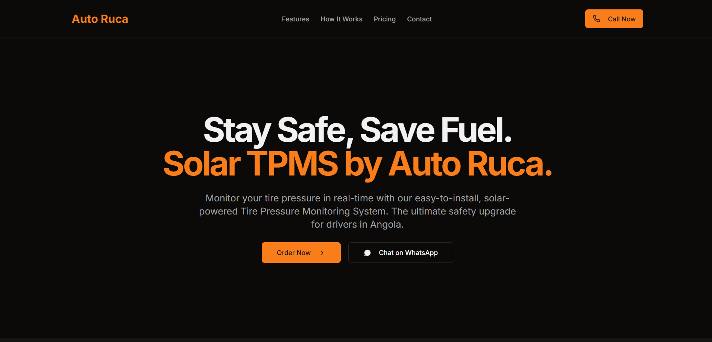
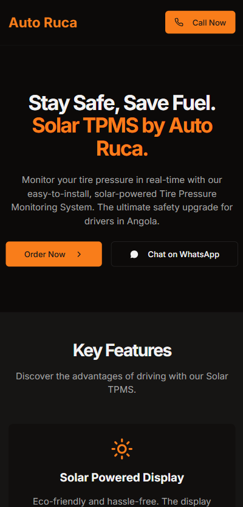

<h1 align="center">☀️ Auto Ruca — Client Project Showcase</h1>

  

---

## 📜 Project Overview

**Auto Ruca** is a business in Luanda specializing in **Solar Tire Pressure Monitoring Systems (TPMS)**.  
They needed a modern, responsive website to showcase their product, build trust with customers, and allow for direct orders via WhatsApp.

This project was delivered as a complete, production-ready web solution — fast, SEO-friendly, and easy to maintain.

🔗 **Live Website:** [autoruca.vercel.app](https://autoruca.vercel.app/)

---

## 🛠 My Role

- Worked directly with the client to understand their needs and branding goals  
- Designed the layout, color scheme, and responsive structure  
- Implemented the frontend with optimized performance in mind  
- Integrated **WhatsApp ordering** for quick customer engagement  
- Deployed the site on **Vercel** for fast, reliable hosting

---

## ✨ Features

- ⚡ **Fast & Responsive** — Mobile-first design, works smoothly on all devices  
- 🎯 **Client-Focused UI** — Tailored design to highlight product benefits  
- 📸 **High-Quality Media** — Clear visuals for strong first impressions  
- 🔍 **SEO Optimization** — Metadata and structure optimized for search engines  
- 📞 **WhatsApp Integration** — Direct, one-click contact system  

---

## 📸 Screenshots

  
  

---

## 🧰 Tech Stack

- **Framework:** Next.js (React)  
- **Styling:** Tailwind CSS  
- **Deployment:** Vercel  
- **Version Control:** Git + GitHub  

---
